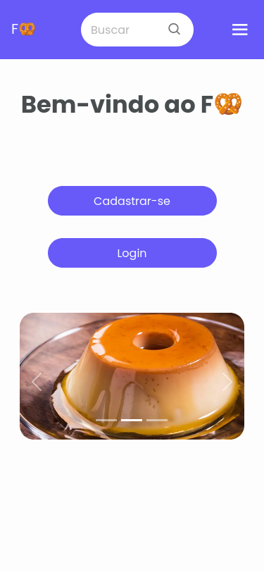
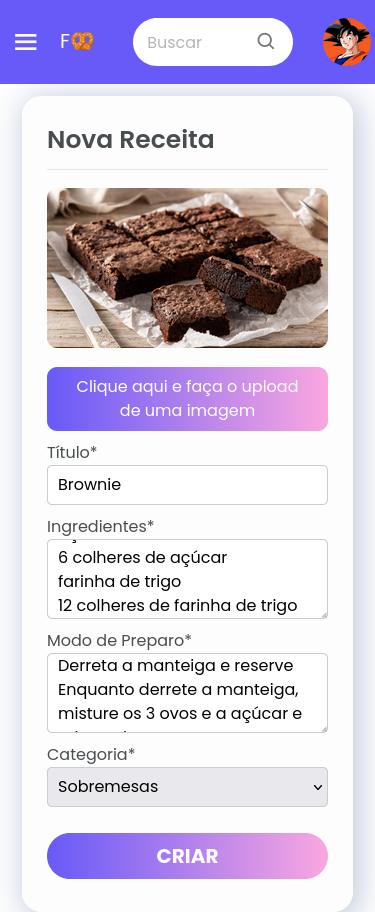
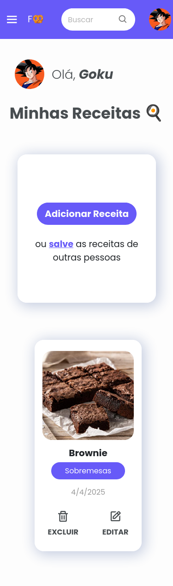
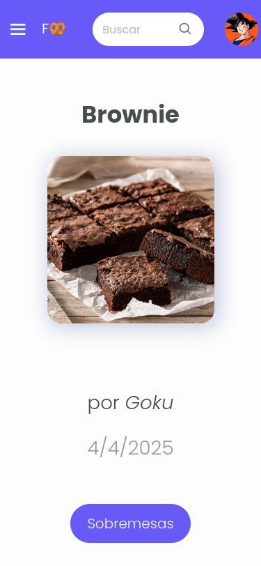
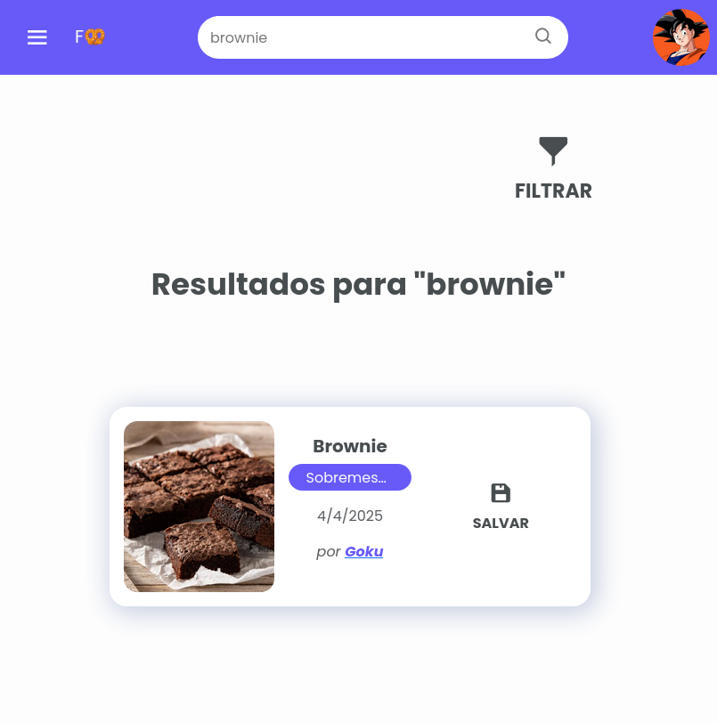

# FoodWritter
FoodWritter é uma rede de compartilhamento de receitas, onde você pode criar receitas, compartilhá-las e também pesquisar por receitas de outras pessoas.

Foi desenvolvido com **Python e Flask**, assim como um banco de dados em **SQLite3** para o trabalho da disciplina de Desenvolvimento Web no 4º semestre do curso de Ciência da Computação na UNIFOR. Possui todas as funcionalidades esperadas de um CRUD, assim como sistema de autenticação de usuários.

O frontend é responsivo e possui testes automatizados.

O trabalho foi desenvolvido em equipe, [confira os colaboradores](https://github.com/Magoninho/recipe-book-app/graphs/contributors)


# Rodando o Projeto Localmente

Siga os passos abaixo para rodar uma instância local do projeto.

### 1. Clone o repositório

```bash
git clone https://github.com/Magoninho/recipe-book-app
cd recipe-book-app
```

### 2. Crie um ambiente virtual

Utilize o `venv` para criar um ambiente virtual do Python:

```bash
python -m venv env
```

### 3. Ative o ambiente virtual

Ative o ambiente virtual de acordo com seu sistema operacional:

- **Linux/macOS**:

  ```bash
  source env/bin/activate
  ```

- **Windows (CMD)**:

  ```cmd
  env\Scripts\activate.bat
  ```

- **Windows (PowerShell)**:

  ```powershell
  env\Scripts\Activate.ps1
  ```

### 4. Instale as dependências

Com o ambiente virtual ativado, instale as dependências do projeto:

```bash
pip install -r requirements.txt
```

### 5. Execute a aplicação

Após instalar as dependências, inicie a aplicação com o comando:

```bash
flask --app recipebook run
```

# Galeria
 | 
-------------------------------------------------------
 | 
-------------------------------------------------------
 | 

